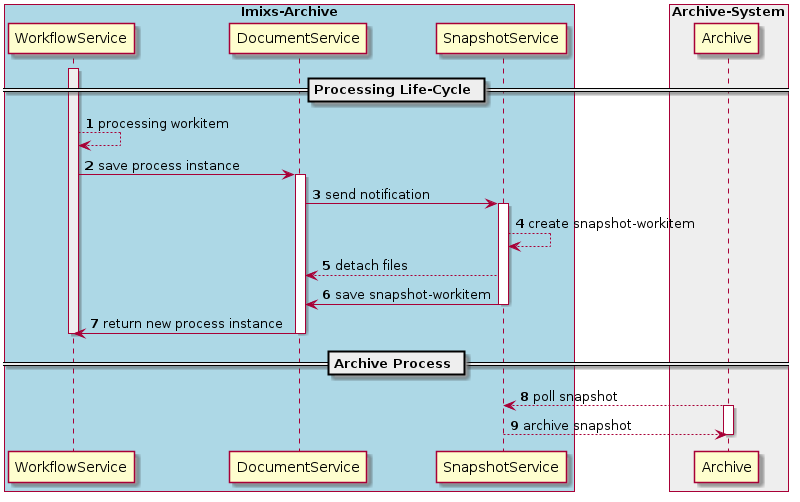

# Imixs-Archive API

The sub-module Imixs-Archive-API provides the core functionality and interfaces to generate, store and retrieve business data into an audit-proof archive system. This api is platform independent and based on the Imixs-Workflow API.  

## What Audit-Proof Archiving Means
Audit-proof archiving means that documents or business information can be searched, traced back to their origin, and stored securely against tampering. From an organizational perspective, a procedure for audit-proof archiving must be transparent for 
all members within an organization.

The Imixs-Archive API combines these aspects together with the [Imixs-Workflow engine](http://www.imixs.org)  into a powerful and flexible business process management platform.
 
### Searching Information
Imixs-Workflow provides the foundation for creating, editing, and searching business data  on intelligible defined process descriptions. Each process instance, controlled by the Imixs-Workflow engine, can be searched through a full-text index. A query can be structured - according to predefined attributes, as well as unstructured - based on search terms in a full-text search.

### Tracing Back Information to its Origin
Any information controlled by Imixs-Workflow contains a detailed and consistently log from its creation to its archiving.  This protocol can be read by both, IT systems and humans. Business information can be stored in an open XML format which is independent from technical platform and storage solutions.  
 
### Protecting Information from Tampering
Based on a BPMN 2.0 process model, business data can be protected from changes at any time within a business process.
Imixs-Workflow supports a fine grained access control on the level of a single process instance. This concept allows protecting data from tampering. In addition, Imixs-Archive supports a snapshot concept that automatically stores business data protected from any further manipulation.
 
 
 
## The Imixs-Snapshot-Architecture

The Imixs-Archive API provides a mechanism to archive the content of a workitem during the processing life cycle into a _snapshot-workitem_.
A _snapshot workitem_ is an immutable copy of a workitem (origin-workitem) including all the business data and file content of attached files. A _snapshot workitem_ can be stored in the workflow data storge or in an external archive storage (e.g. Hadoop).

  

The snapshot process includes the following stages:

1. A process instance is processed by the Imixs-Workflow engine based on a BPMN 2.0 model. 
2. After processing the process instance is persisted into the local workflow storage by the DocumentService.
3. The DocumentService sends a notification of the new or updated process instance to the SnapshotService. 
4. The SnapshotService creates a immutable copy of the process instance - called snapshot-workitem.
5. The snapshot workitem is stored into the local workflow storage
6. An external archive system receives the new snapshot-workitem and stores it into a archive storage. 
7. The origin process instance is returned to the application

 
A snapshot-workitem holds a reference to the origin-workitem by its own $UniqueID which is 
always the $UniqueID from the origin-workitem suffixed with a timestamp. 
During the snapshot creation the snapshot $UniqueID is stored into the origin-workitem. 

### The SnapshotPlugin

The snapshot process includes the following stages:

1. create a copy of the origin workitem instance
2. compute a snapshot $uniqueId based on the origin workitem suffixed with a timestamp.
3. change the type of the snapshot-workitem with the prefix 'archive-'
4. If an old snapshot already exists, Files are compared to the current $files and, if necessary, stored in the Snapshot applied
5. remove the file content form the origin-workitem 
6. store the snapshot uniqeId into the origin-workitem as a reference ($snapshotID)
7. remove deprecated snapshots
 
A snapshot-workitem holds a reference to the origin-workitem by its own $UniqueID which is 
always the $UniqueID from the origin-workitem suffixed with a timestamp. 
During the snapshot creation the snapshot $UniqueID is stored into the origin-workitem. 

Why did we use a Plugin to implement the Snapshot-Architecture? You could say that it is easier to have the snapshot-workitem directly generated by the engine. This avoids that someone can forget to include the plugin in his model. 
But this also accounted for every possibility of control when and if data is archived. With the plugin the control is by the model. And this is important when you are considering legal provisions such as the EU data protection law. 

### How the SnapshotPlugin Works
The SnapshotPlugin implements the ObserverPlugin interface and is tied to the transaction context of the imixs-workflow engine. The process of creating a new snapshot workitem is aware of the current transaction in a transparent way and will automatically role back any snapshots workitems in case of a EJB Exception. The SnapShotPlugin can be included into any model that manages business-critical data.
 

### The Access Control (ACL)
The access to archive data, written into the Imixs-Archive, is controlled completely by the [Imixs-Workflow engine ACL](http://www.imixs.org/doc/engine/acl.html). Imixs-Workflow supports a multiple-level security model, that offers a great space of flexibility while controlling the access to all parts of a workitem. 

# How to Calculate the Size of a Imixs-Archive System?

To calculate the size of an Imixs-Archive system, the following factors are crucial: 

 * Number of tasks within a process flow.
 * Size of Metadata generated during a processing life cycle.
 * Size of documents attached to a process instance. 
 
 
The size for Imixs-Archive is calculated in the following example:
 
 1. The number of individual steps in a sample process includes 10 task
 2. The metadata of a single process instance is between  8KB and 16KB 
 3. The file content  of a single process instance  is between 0,5 MB  and 1 MB

Imixs-Archive generates a snapshot-workitem in each processing step. So the total size of all snapshot-workitems of a single process instance in this example can be up to  1.2 MB. This is an average value that can vary depending on the use case.

Thus, in this exmple a system processing 1 million process instances per year can claim a data volume of 1.2 TB each year.

