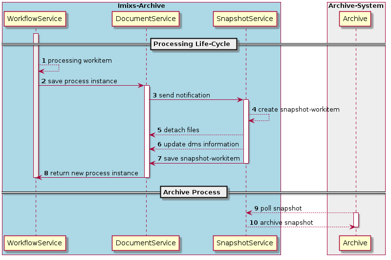

# Imixs-Archive API

The sub-module Imixs-Archive-API provides the core functionality and interfaces to generate, store and retrieve business data into an audit-proof archive system. This api is platform independent and based on the Imixs-Workflow API.  

## What Audit-Proof Archiving Means
Audit-proof archiving means that documents or business information can be searched, traced back to their origin, and stored securely against tampering. From an organizational perspective, a procedure for audit-proof archiving must be transparent for 
all members within an organization.

The Imixs-Archive API combines these aspects together with the [Imixs-Workflow engine](http://www.imixs.org)  into a powerful and flexible business process management platform.
 
### Searching Information
Imixs-Workflow provides the foundation for creating, editing, and searching business data  on intelligible defined process descriptions. Each process instance, controlled by the Imixs-Workflow engine, can be searched through a full-text index. A query can be structured - according to predefined attributes, as well as unstructured - based on search terms in a full-text search.

### Tracing Back Information to its Origin
Any information controlled by Imixs-Workflow contains a detailed and consistently log from its creation to its archiving.  This protocol can be read by both, IT systems and humans. Business information can be stored in an open XML format which is independent from technical platform and storage solutions.  
 
### Protecting Information from Tampering
Based on a BPMN 2.0 process model, business data can be protected from changes at any time within a business process.
Imixs-Workflow supports a fine grained access control on the level of a single process instance. This concept allows protecting data from tampering. In addition, Imixs-Archive supports a snapshot concept that automatically stores business data protected from any further manipulation.
 
 
 
## The Imixs-Snapshot-Architecture

The Imixs-Archive API provides a mechanism to archive the content of a workitem during the processing life cycle into a _snapshot-workitem_.
A _snapshot workitem_ is an immutable copy of a workitem (origin-workitem) including all the business data and file content of attached files. A _snapshot workitem_ can be stored in the workflow data storge or in an external archive storage (e.g. Hadoop).

  

The snapshot process includes the following stages:

1. A workitem is processed by the Imixs-Workflow engine based on a BPMN 2.0 model. 
2. After processing is completed, the process instance is persisted into the local workflow storage by the DocumentService.
3. The DocumentService sends a notification event. 
4. The SnapshotService creates a immutable copy of the process instance - called snapshot-workitem.
5. The SnapshotService detaches the file content form the workitem. 
6. The snapshot workitem is stored into the local workflow storage
7. The origin process instance is returned to the application
8. An external archive system polls new snapshot-workitems
9. An external archive system stores the snapshot-workitems into a archive storage. 

 
A snapshot-workitem holds a reference to the origin-workitem by its own $UniqueID which is 
always the $UniqueID from the origin-workitem suffixed with a timestamp. 
During the snapshot creation the snapshot $UniqueID is stored into the origin-workitem. 

### Snapshot History

The snapshot-service will hold a snapshot history.  The snaphsot history can be configured by the imixs property

	snapshot.history=1 
	
The _snapshot.history_ defines how many snapshots will be stored into the local database. The default setting is '1' which means that only the latest snapshot will be stored.  A setting of '10' will store the latest 10 snaphsot-workitems. 
When the history is set to '0', no snapshot-workitems will be removed by the service. This setting is used for external archive systems.  

### CDI Events

The communication between the service layers is implemented by the CDI Observer pattern. The CDI Events are tied to the transaction context of the imixs-workflow engine. 
See the [DocumentService](http://www.imixs.org/doc/engine/documentservice.html#CDI_Events) for further information. 

### The Access Control (ACL)
The access to archive data, written into the Imixs-Archive, is controlled completely by the [Imixs-Workflow engine ACL](http://www.imixs.org/doc/engine/acl.html). Imixs-Workflow supports a multiple-level security model, that offers a great space of flexibility while controlling the access to all parts of a workitem. 

# How to Calculate the Size of a Imixs-Archive System?

To calculate the size of an Imixs-Archive system, the following factors are crucial: 

 * Number of tasks within a process flow.
 * Size of Metadata generated during a processing life cycle.
 * Size of documents attached to a process instance. 
 
 
The size for Imixs-Archive is calculated in the following example:
 
 1. The number of individual steps in a sample process includes 10 task
 2. The metadata of a single process instance is between  8KB and 16KB 
 3. The file content  of a single process instance  is between 0,5 MB  and 1 MB

Imixs-Archive generates a snapshot-workitem in each processing step. So the total size of all snapshot-workitems of a single process instance in this example can be up to  1.2 MB. This is an average value that can vary depending on the use case.

Thus, in this exmple a system processing 1 million process instances per year can claim a data volume of 1.2 TB each year.

# Deployment

To deploy imixs-archive into Imixs-Office-Workflow the following maven configuration is needed:

 1) Add the following artifact versions into the master pom.xml

		<!-- Imixs-Archive -->
		<org.imixs.archive.version>0.0.2-SNAPSHOT</org.imixs.archive.version>

 2) Add the following dependencies into the section dependencyManagement of the master pom.xml:

		<!-- Imixs-Archive -->
		<dependency>
			<groupId>org.imixs.workflow</groupId>
			<artifactId>imixs-archive-api</artifactId>
			<version>${org.imixs.archive.version}</version>
			<scope>provided</scope>
		</dependency>

		

 3) Add the following dependencies into the pom.xml of the ear module (optional web module if no ear is used.

		<!-- Imixs-Archive -->
		<dependency>
			<groupId>org.imixs.workflow</groupId>
			<artifactId>imixs-archive-api</artifactId>
			 <scope>compile</scope>
		</dependency>
		
		
These dependencies will add the necessary libraries into the /lib folder of the ear module (optional the web module).
The imixs-archive-api should be added directly as a jar module together with the Imixs EJB module (engine, marty), so
that these ejbs are accessable from the workflow engine:

	...
	<plugin>
		<groupId>org.apache.maven.plugins</groupId>
		<artifactId>maven-ear-plugin</artifactId>
		<version>2.6</version>
		<configuration>
			.....
			<modules>	
				....
				<JarModule>
					<groupId>org.imixs.workflow</groupId>
					<artifactId>imixs-archive-api</artifactId>
					<bundleDir>/</bundleDir>
				</JarModule>  
				...
			</modules>
			...
		</configuration>
	</plugin>
	...

	
# Testing

The imixs-archive-api module includes jUnit tests. The jUnit test class _org.imixs.archive.api.TestSnaptshotService_ mocks the EJB _SnapshotService_ and simulates the processing of a workitem within the [Imixs WorkflowMockEnvironment](http://www.imixs.org/doc/testing.html#WorkflowMockEnvironment). The test BPMN model '_TestSnapshotService.bpmn_' is used to simulate a workflow. 

# Migration

The SnapshotService replaces the now deprecated BlobWorkitem functionality from the DMSPlugin. For a migration only the SnapshotService need to be added. The SnapshotService automatically migrates the deprecated blob-workitems. 

No further migration step is necessary.

The Item 'dms' with the file meta information will still be handled by the DMSPlugin. 

