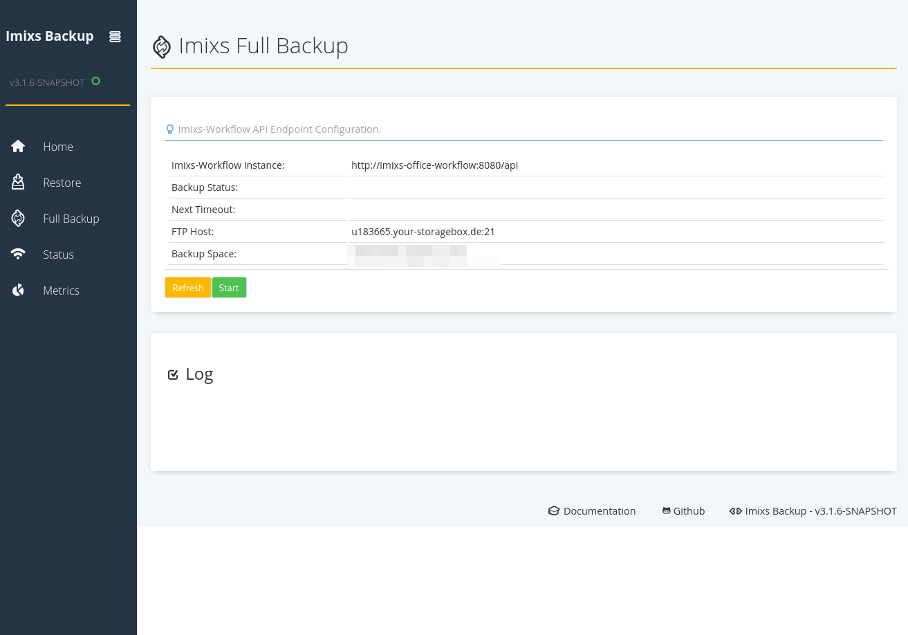
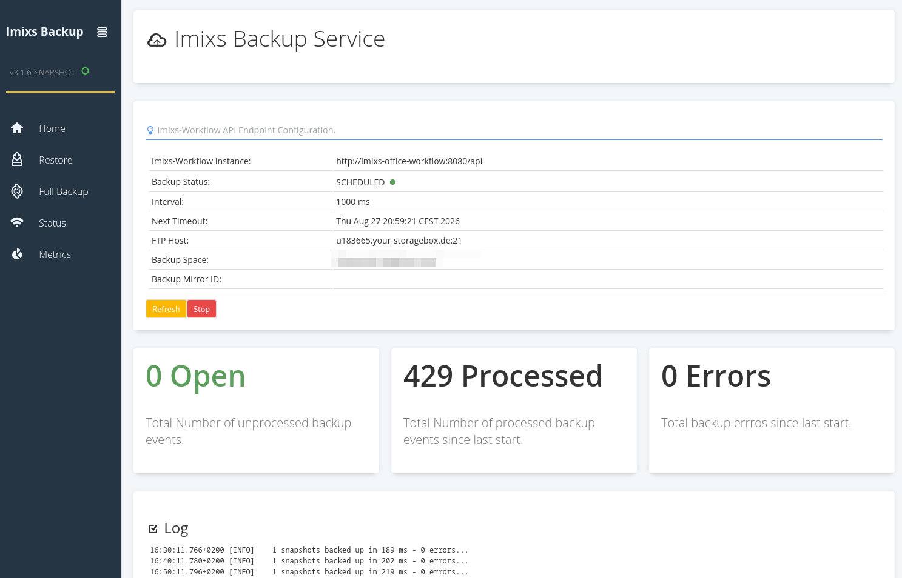
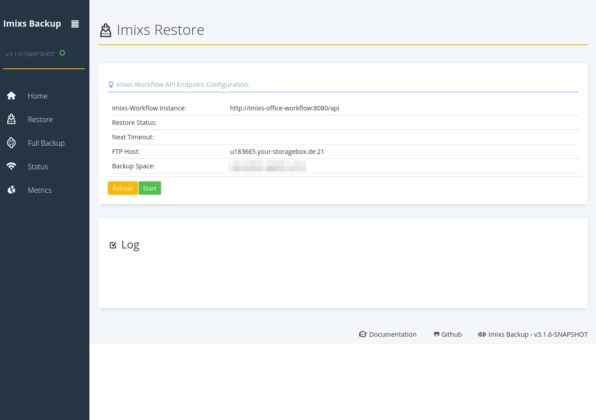

# Imixs-Workflow - Backup Mirror System

Imixs-Workflow is a transactional, highly available business process management suite. The source code is freely accessible via [Github](https://github.com/imixs/). Regardless of the chosen operating model of you workflow application (SaaS, Public Cloud, Private Cloud, OnPremise), you are and you should remain the owner of your business data. With the **Backup Mirror System**, you have the ability to independently create a complete copy of your business data at any time and access it – regardless of how and where your instance is currently being operated.

## 1. Architecture – Own your Data

Your business transactions and documents are managed in an Imixs-Workflow instance running in a highly available cluster architecture. The Backup Mirror System gives you the ability to create a complete, continuously updated copy of your business data on your own infrastructure. The backup data is stored in an open, [documented XML format](https://www.imixs.org/doc/core/xml/index.html), which can be read and processed independently of any specific software.
The Backup Mirror System runs independently of the Imixs-Workflow instance on your own infrastructure and retrieves the data via a pull mechanism. We do not need access to your network, and we do not establish a connection to you.

A mirror backup is an important prerequisite for being able to perform a so-called disaster recovery in the event of data loss or an unforeseeable system failure. In this scenario, you can either initiate a data restore yourself or rebuild the system entirely on your own.

### 1.1 How it works - Change Data Capture (CDC)

Technically, the concept is based on the open source project [Imixs-Archive](https://github.com/imixs/imixs-archive), specifically the _Imixs-Archive-Backup_ component. Data backup is performed using the Change Data Capture (CDC) method. This is a software technique that detects, tracks, and delivers changes at the record level – such as insertions, updates, and deletions – to downstream systems in near real time.

Overview of the process:

1. Every time a business transaction is created or modified, your workflow instance automatically generates an immutable snapshot (a complete copy of the transaction including all attached documents).
2. These snapshots are made available via the REST interface of your workflow instance.
3. A backup service installed on your side (see Section 2) automatically retrieves these snapshots and stores them in a location of your choice (e.g. your own FTP/storage server).

Important: The connection is established **from your system to our workflow instance** ("pull principle"). This means only network access to the REST interface of your instance is required. The workflow instance itself does not need – and should not be given – access to your infrastructure. This is an important prerequisite for a secure separation between operations and the backup system.

---

## 2. Technical Setup

The Backup Mirror System is provided by us as a Docker container and can be operated in various environments:

- **Local**: locally via Docker or Docker Compose,
- **Private Cloud**: in a private cloud (e.g. Kubernetes, OpenShift)
- **Public Cloud**: in a public cloud environment (e.g. AWS, Microsoft Azure)

The Docker image is freely available via Docker Hub:

- https://hub.docker.com/r/imixs/imixs-archive-backup/tags

### 2.1 Prerequisites

The following prerequisites should be met for operation:

- Your own server or container environment (Docker) within your infrastructure
- Your own storage location for the backup data (e.g. FTP storage, NAS with FTP connectivity)
- A so-called **Mirror ID**, which we provide to you

### 2.2 Requesting a Mirror ID

The Mirror ID is an organizational identifier that we use to enable your own backup connection for your instance. It is not a security feature in the strict sense, but rather an agreement between us: _"Customer X operates their own backup."_ Please request this ID from us informally.

### 2.3 Creating a Backup User in Your Own Instance

The Backup Mirror System is autonomous and technically separate. Only a technical user in your workflow instance is required, through which the backup access is performed. You can create this user yourself – we neither know the password nor manage this account. Assign the user sufficient read permissions so that it can back up all relevant transactions and documents. With 'Manager' permissions, you guarantee full access.

### 2.4 Docker Compose Example Configuration

The following example shows a Docker Compose configuration for operating the backup service:

```yaml
version: "3.6"
services:
  backup:
    image: imixs/imixs-archive-backup:latest
    environment:
      TZ: "Europe/Berlin"
      WORKFLOW_SERVICE_ENDPOINT: "https://<your-instance>.office-workflow.de/api/"
      WORKFLOW_SERVICE_USER: "<your-backup-user>"
      WORKFLOW_SERVICE_PASSWORD: "<your-password>"
      WORKFLOW_SERVICE_AUTHMETHOD: "form"
      BACKUP_FTP_HOST: "<your-storage-host>"
      BACKUP_FTP_PATH: "<your-target-directory>"
      BACKUP_FTP_PORT: "21"
      BACKUP_FTP_USER: "<your-ftp-user>"
      BACKUP_FTP_PASSWORD: "<your-ftp-password>"
      BACKUP_MIRROR_ID: "<your-mirror-id>"
    ports:
      - "8084:8080"
      - "9990:9990"
```

The FTP storage here also stands for encrypted storage systems such as SFTP or FTPS, which are explicitly recommended.

It is recommended not to store security credentials directly in the container configuration itself.

**Configuration / Parameters:**

| Parameter                        | Meaning                                                     |
| -------------------------------- | ----------------------------------------------------------- |
| `WORKFLOW_SERVICE_ENDPOINT`      | The REST API address of your workflow instance hosted by us |
| `WORKFLOW_SERVICE_USER/PASSWORD` | The backup user you created yourself                        |
| `BACKUP_FTP_*`                   | Your own storage location for the backup data               |
| `BACKUP_MIRROR_ID`               | The activation ID provided by us                            |
| `BACKUP_FTP_PATH`                | Target directory on the FTP storage                         |

**Optional Parameters**

| Parameter                    | Meaning                                                 |
| ---------------------------- | ------------------------------------------------------- |
| `WORKFLOW_SYNC_INTERVAL`     | Polling interval in milliseconds (default 3000)         |
| `WORKFLOW_SYNC_INITIALDELAY` | Initialization duration in milliseconds (default 60000) |

After startup, the service regularly checks for new transactions to be backed up and automatically transfers them to your storage location.

### 2.5 Initial Synchronization

After the first start, use the "Full Backup" function to request the transfer of your entire existing data set. Without this step, the service will only back up transactions that are newly created or modified from the point of commissioning onward – your historical data would be left out.

Depending on the volume of data, this process can take anywhere from several hours to several days. During the full backup, the event log will contain a very large number of open entries – for large data sets, potentially several hundred thousand. This is normal and not a sign of a malfunction.



An interruption is not critical: open entries in the event log are retained and continue to be processed after a restart.
You can track progress via the dashboard of the backup service.

### 2.6 Monitoring Your Own Backup Service

The Backup Mirror System has a dashboard that gives you an overview of the backup status:



Additional service endpoints are suitable for readiness checks. In Kubernetes, you can integrate these as a liveness probe so that the container is automatically restarted in the event of a persistent failure.

| Endpoint   | Description                                                                                                                                                                                                                                                 |
| ---------- | ----------------------------------------------------------------------------------------------------------------------------------------------------------------------------------------------------------------------------------------------------------- |
| `/health`  | Returns the health status of the service according to the MicroProfile Health standard – including readiness (is the service operational, e.g. is there a connection to the workflow API and FTP storage?) and liveness (is the process running correctly?) |
| `/metrics` | Returns operational metrics in MicroProfile Metrics format (Prometheus-compatible), e.g. number of processed backups, error counters, runtimes                                                                                                              |

Whether a backup is running cannot be determined by whether data is being transferred – because if no transactions have been processed, there is nothing to transfer. On a Sunday or during a period of inactivity, a silent backup service is the normal state.
Instead, the event log is the decisive factor: an entry is created for every change, which disappears once it has been successfully backed up. If the log is empty, your mirror data set is up to date with the primary platform. If entries remain open for an extended period and their number keeps growing, the backup is falling behind.
This status can be queried live via the health endpoint:

```json
{
  "status": "UP",
  "checks": [
    { "name": "suspend-state", "status": "UP", "data": { "value": "RUNNING" } },
    {
      "name": "deployments-status",
      "status": "UP",
      "data": { "imixs-archive-backup.war": "OK" }
    },
    { "name": "server-state", "status": "UP", "data": { "value": "running" } },
    { "name": "boot-errors", "status": "UP" },
    { "name": "started-deployment.imixs-archive-backup.war", "status": "UP" },
    {
      "name": "imixs-backup",
      "status": "UP",
      "data": {
        "backup_events_unprocessed": 0,
        "backup_events_processed": 254,
        "backup_events_errors": 0,
        "backup.status": "ok"
      }
    },
    { "name": "ready-deployment.imixs-archive-backup.war", "status": "UP" }
  ]
}
```

The decisive data point for the backup status here is 'backup_events_unprocessed':

| Observation                  | Interpretation                                                                   |
| ---------------------------- | -------------------------------------------------------------------------------- |
| Event log empty              | Mirror data set is up to date                                                    |
| A few dozen open entries     | not unusual – processing happens asynchronously                                  |
| A few hundred open entries   | observe over a longer period                                                     |
| Over a thousand open entries | outside of a full backup, investigate the cause and involve support if necessary |

### 2.7 Deletion and Anonymization of Personal Data (GDPR)

The main system meets the requirements of the GDPR. If personal data is removed there as part of a deletion or anonymization process, this change is automatically transferred to the mirror system via the CDC mechanism described above. A deletion or anonymization in the main system is thus also reflected in the backup data set. No manual intervention in the mirror system is required for this.

---

## 3. Disaster and Recovery Scenario (Disaster Recovery)

If your primary platform fails or data is missing, you initiate the restoration directly via the dashboard of your backup service. No additional configuration is required – the service is already connected to your instance, and this connection is also the prerequisite for the restoration.



Before every write operation, the restoration process checks the state of the target system and does not overwrite any existing data. Only data that is actually missing there is transferred. An accidentally triggered restore therefore cannot cause any damage – if in doubt, you may start the process.

**Basic principle of the restoration process:**

- Your backed-up snapshot data is stored completely and unchanged in your own storage (FTP/storage).
- This data is stored in an open, platform-independent XML format and is not tied to our specific infrastructure.
- Based on this data, a new Imixs Workflow instance can be set up (either by you or by another service provider).
- Using the restore function of the Imixs-Archive components, the snapshots are transferred back into the new instance – each business transaction is restored including its history and all documents.

**Key points for an emergency:**

- Backup data is fully available to you → no dependency on us
- Restoration requires a functioning Imixs Workflow environment (open source, freely available)
- The technical restore procedure is part of the public Imixs-Archive documentation

## 4. Summary

With the Backup Mirror System, you remain the owner of your business data at all times – regardless of how and where your instance is operated. You set up the service yourself, manage it independently, and thereby retain full control over your additional copy of the data. It is precisely this independence that enables you to fully rebuild your system if needed. Operating an independent backup instance is an essential prerequisite for data security!

In the event of an emergency, we are of course happy to support you with the rebuild as well – however, this support is **not a prerequisite**, since the data and the recovery procedure can be used entirely independently of us.

If you have any questions about the setup or about requesting your Mirror ID, please feel free to contact us.
