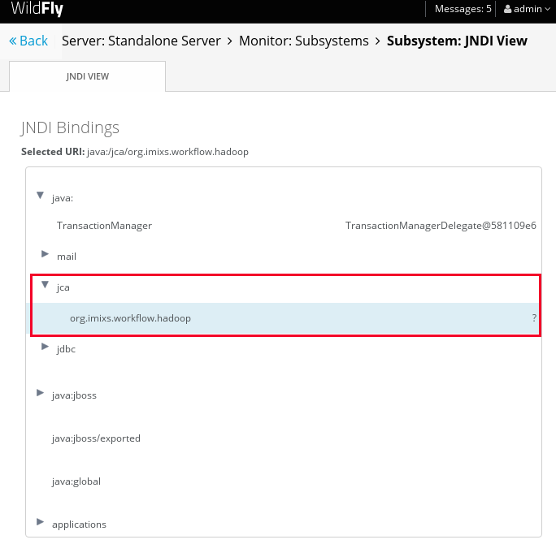

# Imixs-Archive-Hadoop JCA 

The goal of the Imixs-Archive-Hadoop-JCA project is a JCA connector to simplify the communication with a Hadoop Cluster from a EJB. One reason for deciding to implement a JCA module is the synchronization with the transaction context when running in a stateless session EJB. In case the EJB or other EJB running in the same transaction throwing a runtime exception, the hadoop data written during the pre-commit-phase must be restored. 

The JCA module is based on the scaffolder shown in this tutorial:  

http://www.mastertheboss.com/jboss-frameworks/ironjacamar/create-your-first-jca-connector-tutorial

**NOTE: THIS WORK IS JUST IN PROGESS AND NOT PRODUCTION READY!**

# Build

Imixs-Archive-Hadoop-JCA is provided as a Maven project. The project defines the profile 'wildfly' which includes the 'maven-rar-plugin' to generate the rar file. 

To build the rar file run the maven command:

	mvn clean install rar:rar -Pwildfly

The wildfly profile also contains a wildfly deploymetnt plugin for a autodeployment into a wildfly server. 
To build the rar file with the autodeployment option sfor wildfly run the maven command:

	mvn clean install rar:rar wildfly:deploy -Pwildfly

# Installation

To install the .rar file just move it into the folder /standalone/deploymentens/ 
or use the Wildfly Web console for deployment. 

After the installation was successfull, the module should be visible in the Wildfy JDNI Viewer:

  

See also : https://docs.jboss.org/author/display/WFLY10/Resource+adapters

Deploment Strategy: https://docs.jboss.org/author/display/WFLY8/Developer+Guide#DeveloperGuide-DeploymentModuleNames

## Testing

To verify the JCA adapter, the WebServlet '*org.imixs.workflow.archive.hadoop.jca.JCATestServlet*' located under /src/test/java/
can be used as an example code for test cases.

**NOTE:** This WebServlet must be deployed into a web module - this is only an
 * example code!

# Tutorials

### Wildfly 10 Tutorial:

see: http://www.mastertheboss.com/jboss-frameworks/ironjacamar/create-your-first-jca-connector-tutorial

### Adam Bien GenericJCA example:

https://github.com/dlee0113/java_ee_patterns_and_best_practices/tree/master/GenericJCA

### xadisk Example on GitHub:

https://github.com/maroph/xadisk
