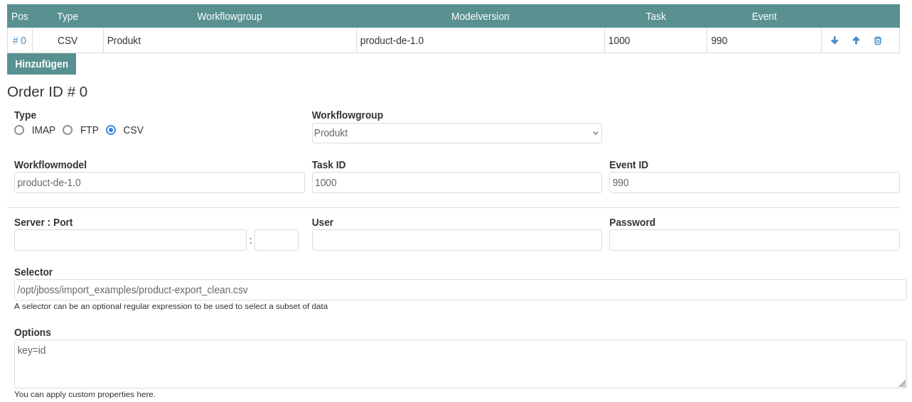

# The CSV Importer

The CDI bean _CSVImporterService_ is a generic implementation to import documents form a CSV File located on a FTP server. The implementation access the FTP server via FSTP on the default port 990.

The selector attribute is used to define the path to the target file with the file extension '.csv'. For each entry in the CSV file a new document instance will be created. Currently no workflow processing is supported.

The _CSVImporterService_ verifies the content of a CSV file by a MDA checksum. Only if the MDA checksum has changed the import process will be started. The MDA will be printed into the log and can be verified by a administrator.

## The CSV Options

The following option entries are mandatory:

- **type** - defines the document type of the stored entries
- **key** - defines the key item to be used to select the entity by a unique key.

The options 'type' and 'key' are mandatory.

**Note:** The _CSVImporterService_ does currently not support combined keys. It must be ensured that the CSV files contains a column with unique keys.

## Workflow Processing

Optional a data entry can be processed by a workflow event. The process model can either be defined by the model version or by the workflow group.

- **Workflowmodel** - defines the workflow model version (optional if workflow group is provided)
- **Workflowgroup** - defines the workflow group (optional if workflow model version is provided)
- **Task ID** - defines the task ID a new imported entity is assigned to
- **Event ID** - defines the event ID the entiy will be processed

If the workflow processing failed or not workflow model data is provided the entity will be saved only!

## Local File Import

You can also import files from a local server directory. In this case server/port must be empty.
In the selector you can specify the full file path on the local server directory.

