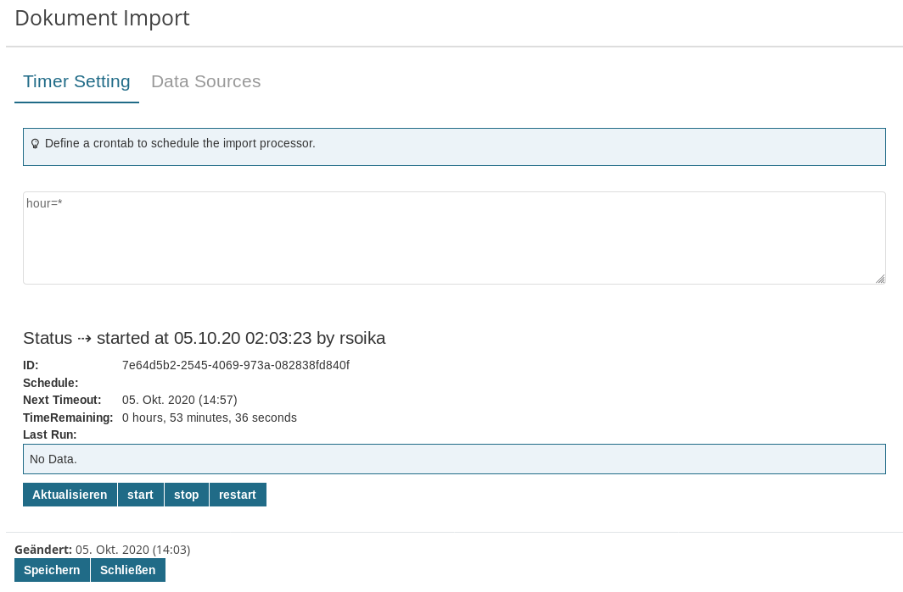

# Imixs-Archive-Importer

The Imixs-Archive Importer module provides a generic import service to be used to import documents form various external sources (document source) like a FTP server or a IMAP account. 

The Importer service is based on the Imixs-Scheduler API to perform imports on a scheduled base. The scheduler sends CDI events which can be consumed specific importer implementations. In this way the Importer service is highly extensible. The following import sources are supported:

 - FTP - import form a ftp server 
 - IMAP - import form an email box via IMAP
 
 
# Scheduling

The implementation of the Imixs *DocumentImportScheduler* is based on the EJB 3.1 Timer Service specification. The syntax takes its roots from the Unix cron utility to be configured. The following shows an example to run the scheduler all 15 minutes

	minute=*/15
	hour=*

## The Document Source Object

Each external document source is represented by a so called *document source object*. The *document source object* provides at least the following properties used by a CDI observer implementation to access the data source and to create a new workflow instance:

 - *server* - server address of the document source including a host name and a protocol
 - *port* - an optional server port
 - *user* - optional user id to access the server
 - *password*
 - *task* - the BPMN task ID a new workitem is assigned to
 - *event* - the BPMN event ID a new workitem is processed 
 - *workflowgroup* - the workflow group the new workitem should be assigned to
 - *modelversion* - optional modelversion the new workitem is assigend to
 - *selector* - an optional selector to specify the source (e.g. a path on a FTP server)
 
 
### The Document Source Options
 
A *document source object* can provide additional options in the item '*options*'. The *DocumentImportService* provides a convenient method to get a Properties object for all options. In this way a concrete Document Source implementation can access the options:
 
	// get properties form source object
	Properties properties = documentImportService.getOptionsProperties(ItemCollection source);
    

 
## The Web UI

The Importer adapter provides a JSF Web UI component to be used for jsf applications. This ui component is optional and can be implemented also in a customized way. 

### The DocumentImportController

The CDI Bean *DocumentImportController* is used to display and select data sources. The controller can be extend for individual source definitions. 

# FTP Importer

The CDI bean *FTPImporterService* is a concrete implementation to import documents form a FTP server. The implementation access the FTP server via FSTP on the default port 990. 

The selector attribute is used to define an optional directory. If no selector is specified the documents are read from the / root directory. 

**Note:** The *FTPImporterService* expects a secure FTPS connection. 
FTPS is FTP using the [SSL/TLS protocol](https://en.wikipedia.org/wiki/Secure_Sockets_Layer) for encryption. FTPS adds support for the Transport Layer Security (TLS) and the Secure Sockets Layer (SSL) cryptographic protocols. This is different from  from the SCP/SFTP which is not supported. If your FTP data source does not support FTPS the *FTPImporterService* can not be used.

# Mail IMAP Importer

The CDI Bean *IMAPIImporterService* is a concrete implementation to import documents form a IMAP server. This module provides also services to convert Java Mail Message objects into HTML or PDF.

## The Import Folder

With the 'Selector' attribute you can define the IMAP folder from which the Mail Importer imports mails. If no selector is set the default IMAP Folder 'INBOX' is scanned. This is typically the default folder for most IMAP servers. 

## The Archive Folder

After the *IMAPIImporterService* has imported a single message successfully the message will be moved into a IMAP archive folder named 'imixs-archive'. This folder will be automatically created if it does not yet exist on the IMAP server.
You can change the name of the archive folder by setting the option 'archive.folder'

	archive.folder=Invoice-Archive

## Filtering Mails by subject using regular expressions

It is possible to filter emails by a subject. Therefor a regular expression can be added by the option property named "subejct.regex" - e.g.:

	filter.subject=(order|offer|invoice*)

In this example only messages with the text 'order', 'offer' or starting with 'invoice' will be imported. 

## Detachment Mode

The *IMAPIImporterService* provides the ability to detach files from an mail message object. The behaviour can be configured by the option property named "detach.mode". The following detach modes are supported:

 - PDF - only PDF files attached will be detached together with the origin .eml file to the workitem. This is the default mode.
 - ALL - all files will be detached and the email content will be attached as a HTML file to the workitem.
 - NONE - no files will be detached and the origin email object will be attached as a .eml file to the workitem.

To set the detachment mode add the option to the IMAP source:

	detach.mode=ALL

## Preserve Origin Message

In case of detach.mode=ALL, the option 'preserve.origin' defines if the origin email will be attached. 

	preserve.origin=false

If the option is set to false, the .eml file will not be attached. The default value is 'true'. 

**Note:** In case of the detach.mode = 'PDF' or 'NONE' the origin mail file will always be attached.
	

## Custom Mail Options

The *IMAPIImporterService* connects to an mail server via IMAPS per default. IMAPS (IMAP over SSL/TLS) is assigned the port number 993. You can overwrite the default protocol by the property "mail.store.protocol" via custom mail options in the document source options. In this way it is also possible to set additional custom mail options concerning various aspects of your mail/imap server.  See the following example, setting some extra java mail options:

	mail.store.protocol=imap
	mail.imap.ssl.enable=true
	mail.imap.port=587
	mail.imap.ssl.trust=*
	
You can find a list of all IMAP settings [here](https://www.tutorialspoint.com/javamail_api/javamail_api_imap_servers.htm)

## Gotenberg HTML PDF Converter

[Gotenberg](https://thecodingmachine.github.io/gotenberg/) is a Docker-powered stateless API for converting HTML, Markdown and Office documents to PDF. This service can be used to convert a Mail into a PDF document. This option applies only to the option 'detach.mode=ALL'.

To activate this feature add the following options to the import source:

	detach.mode=ALL
	gotenberg.service=http://gotenberg:3000

A Gotenberg service can be started as a Docker Container:

	  gotenberg: 
	    image: thecodingmachine/gotenberg:6
	    ports:
	      - "3000:3000" 

# CSV Importer

The CDI bean *CSVImporterService* is a generic implementation to import documents form a CSV File located on a FTP server. The implementation access the FTP server via FSTP on the default port 990. 

The selector attribute is used to define the path to the target file with the file extension '.csv'. For each entry in the CSV file a new document instance will be created. Currently no workflow processing is supported.

The *CSVImporterService* verifies the content of a CSV file by a MDA checksum. Only if the MDA checksum has changed the import process will be started. The MDA will be printed into the log and can be verified by a administrator. 

## The CSV Options

The following option entries are mandatory:

 - **type** - defines the document type of the stored entries 
 - **key** - defines the key item to be used to select the entity by a unique key.
 
The options 'type' and 'key' are mandatory. 
 
**Note:** The *CSVImporterService* does currently not support combined keys. It must be ensured that the CSV files contains a column with unique keys. 

