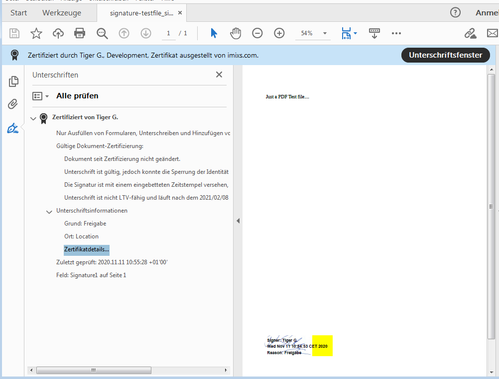

# Imixs-Archive Signature API

The *Imixs-Archive Signature API* provides a service to sign PDF documents attached to a Imixs-Workflow workitem during the workflow processing life-cycle. 

The signing process did not only sign a PDF document with a X509 certificate, but also adds a visual element into the PDF document linked to the signature. This gives the user the possibility to visually recognize the signature and control the validity of the document based on the embedded digital signature.

The implementation is based on the Apache project [PDFBox](https://pdfbox.apache.org/) and the Crypto-API [Bouncycastle](http://bouncycastle.org/). 

## Installation

The *Imixs-Archive Signature API* can be added to the Imixs-Workflow engine with the following maven dependencies:

		<dependency>
			<groupId>org.imixs.workflow</groupId>
			<artifactId>imixs-archive-signature</artifactId>
			<version>${org.imixs.archive.version}</version>
			<scope>compile</scope>
		</dependency>
		<!-- Apache PDFBox -->
		<dependency>
			<groupId>org.apache.pdfbox</groupId>
			<artifactId>pdfbox</artifactId>
			<version>2.0.19</version>
			<scope>compile</scope>
		</dependency>
		<!-- Bouncycastle -->
		<dependency>
			<groupId>org.bouncycastle</groupId>
			<artifactId>bcmail-jdk15on</artifactId>
			<version>1.67</version>
			<scope>compile</scope>
		</dependency>
		

## Signing a PDF Document

To sign a PDF document, a signature with a X509 certificate is created based on the content of the PDF document. The signature is written back into a new signed version of the origin document. The X509 certificates are stored in a java keystore. 

### The Keystore

The *Imixs-Archive Signature API* expects a keystore containing certificates and key pairs to create a signature. The keystore can be managed with the java command line tool *keytool*. The Keytool is provided with standard JDK, so usual no additional installation is necessary. 

A Keystore can keep several keys pairs, each of them is created with a proper alias to be identified by the *Imixs-Archive Signature API*. Any kind of X509 certificate can be used in the signing process and also certificate chains are supported. The keystore is independent form this API.

To create a self-signed certificate with the alias 'imixs' run:

	$ keytool -genkey -alias imixs -keyalg RSA -sigalg SHA256withRSA -keysize 2048 -validity 3650 -keystore imixs.jks

In this example, a 2048-bit RSA key pair valid for 365 days under the specified alias 'imixs' is generated. 
The key pair is added into the keystore file with default ‘.jks’ extension.
The keystore expects a password. This password will be used later by the *Imixs-Archive Signature API* to open the keystore. 
 Note: the certificates are usually stored with an empty password. You can find more details about how to manage the keystore [here](docs/README.md). 

 
### The PDF Signing Service

The *Imixs-Archive Signature API* provides a signing service to sign PDF documents with a X509 certificate stored in a java keystore. The service can be configured by the following environment variables:

 * SIGNATURE_KEYSTORE_PATH - path to a java keystore containing valid certificates and private keys
 * SIGNATURE_KEYSTORE_PASSWORD - the password used to unlock the keystore
 * SIGNATURE_KEYSTORE_TYPE - keystore file extension (defautl =.jks)
 * SIGNATURE_TSA_URL - an optional Time Stamping Authority (TSA) server
 * SIGNATURE_ROOTCERT_ALIAS - the root cert alias
 * SIGNATURE_ROOTCERT_PASSWORD - the root cert password (optional)

The service adds a didgital signature to a new version of a given PDF document and also creates a visual element linked with the signature.
The implementation to sign a PDF document is based on the open source library [PDFBox](https://github.com/apache/pdfbox) and the crypto API [Bouncycastle](http://bouncycastle.org/). General examples how to sign a PDF document with PDFBox including visible signatures can be found [here](https://github.com/apache/pdfbox/tree/trunk/examples/src/main/java/org/apache/pdfbox/examples/signature). 
An introduction how signing PDF files works can also be found [here](https://jvmfy.com/2018/11/17/how-to-digitally-sign-pdf-files/).

### The Signature Adapter

The SignatureAdapter integrates the *Imixs-Archive Signature API* into a business process based on a Imixs BPMN model. The adapter automatically signs attached PDF documents. 

	org.imixs.archive.signature.workflow.SignatureAdapter
	
The SignatureAdapter does throw a PluginException in case not certificate for the current user was not found by the CA Service. The CAService can be used to generate user certificates	based on a root certificate. 

#### Configuration
The adapter creates a new  certificate (autocreate=true) or signs the document with the root certificate if no user certificate exists (rootsignature=true)

	<signature name="autocreate">true</signature>
	<signature name="rootsignature">false</signature>
	<signature name="filepattern">order.pdf</signature>

**autocreate**

If autocreate=true than in case no certificate for the current user exists, the SignatureAdaper will create a certificate on the fly.

**rootsignature**

If no no certificate for the current user exists, a document will be signed with the root certificate.

**filepattern**

A  regular expression to filter the attachments do be signed by the plugin. If no file pattern is set, only PDF files will be signed 

	(^.+\\.([pP][dD][fF])$).

The following example will sign all pdf files with the sufix 'order.pdf'

	 (^.+order.pdf)

You can find general details about how to use an Adapter with Imixs-Workflow [here](https://www.imixs.org/doc/core/adapter-api.html).

	
## The CA Service
	
The CAService provides methods to managed X509Certificates stored in a keystore. The certificates managed by this service
are  used for  digital Signature only. Certificates are singed based on an existing root or intermediate Certificate stored in a keystore.

The Certificates generated by this service have empty passwords and are protected by the keystore. Optinal the root certificate can be password protected. Certificates managed by this service should never be published and should be used for digital signatures only

If a for a given alias not certificate is yet stored in the keystore, the CAService automatically creates a new X509 certificated with the class X509CertificateGenerator. This generator can be used independently from this API. There are also JUnit tests available demonstrating the core functionality. 
