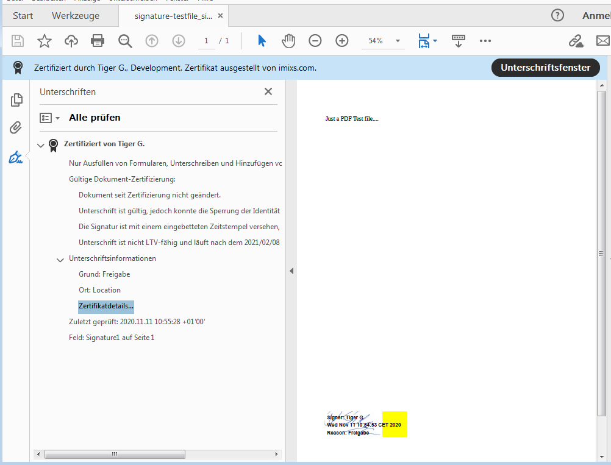
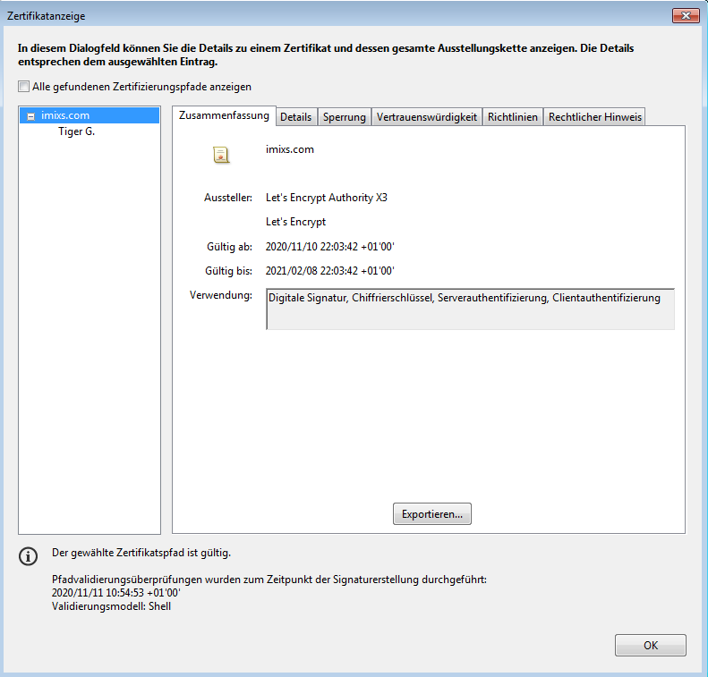

# Keytool

The keystore used by the *Imixs-Archive Signature API* can be managed with the java command line tool *keytool* and is independent form this API and can be linked by an environment variable. 

To create a new  keystore with a self-signed certificate with the alias 'imixs' run:

	$ keytool -genkey -alias imixs -keyalg RSA -sigalg SHA256withRSA -keysize 2048 -validity 3650 -keystore imixs.jks

The keystore expects a password. This password will be used later by the *Imixs-Archive Signature API* to open the keystore and to create a signature.

In the example above a 2048-bit RSA key pair valid for 365 days under the specified alias 'imixs' was generated. 
 The key pair is added into the keystore file with default ‘.jks’ extension. The private key is used later to sign a pdf, the public one will be used to signature verification. 
 
You can verify the content of the keystore:

	$ keytool -list -v -keystore imixs.jks

### Self-Signed Certificate

Using this API with a self-signed certificate isn’t worth too much as long as it’s not trusted. This means, that everyone who gets the signed PDF with a self-signed certificate has to trust that it’s correct. In this case a partner can of course manually add the certificate to his list of trusted certificates. In this szenario the certificate with a public key has to be send to the partner first. 

In Acrobat Reader you can add a certificate like followed:

 1. Open a signed PDF in Acrobat Reader
 2. Click Signature Panel
 3. Expand Signature Details and click Certificate Details
 4. Go to Trust tab and click Add to Trusted Certificates…
 5. Click OK

Now when you reopen the PDF, the signature is valid.

### Trusted Certificate

The Adobe Reader has a list of  Trusted Certificates, and if you have one of them you don’t have to send the certificate to your clients. Just visit the Adobe site where you can find an [Approved Trust List](https://helpx.adobe.com/acrobat/kb/approved-trust-list1.html), then contact with one of the Certification Authority and request a certificate. When you get your certificate just put them to your keystore.

### Let’s Encrypt

The following section explains how to obtain a certificate form the Let’s Encrypt CA to be used with the *Imixs-Archive Signature API*. We assume that you have control over a internet domain to be able to generate a Let’s Encrypt certificate manually. 
find also more details [here](https://ordina-jworks.github.io/security/2019/08/14/Using-Lets-Encrypt-Certificates-In-Java.html).

**1. Install certbot**

To obtain a certificate form the Let’s Encrypt  you need to install the *certbot* tool:

	$ sudo apt install certbot
	
**2. Retrieve a Root Certificate**
	
Next you can retrieve a root certificate from Let’s Encrypt with a DNS challenge by using the certbot tool in the 'manual' mode:

	$ sudo certbot certonly --manual --preferred-challenges dns -d foo.com
	
(replace 'foo.com' with your own internet domain name)

After the successful DNS challenge you will find the chain and key files at:

	/etc/letsencrypt/archive/foo.com/
	
**3. Import the Root Certificate**	
	
The keytool does not allow to import multiple public and private .pem certificates directly. So first you’ll need to add all .pem files to a PKCS12 archive. This can be done with the OpenSSL tool:
	
	$ sudo openssl pkcs12 -export \
	 -in /etc/letsencrypt/live/foo.com/cert.pem \
	 -inkey /etc/letsencrypt/live/foo.com/privkey.pem \
	 -out foo.com.p12 \
	 -name foo.com \
	 -CAfile /etc/letsencrypt/live/foo.com/fullchain.pem \
	 -caname "Let's Encrypt Authority X3" \
	 -password pass:changeit
	
	
Change foo.com with your own DNS name. 

Next you can import the certificates into your keystore:
	
	keytool -importkeystore \
	  -deststorepass changeit \
	  -destkeypass changeit \
	  -deststoretype pkcs12 \
	  -srckeystore foo.com.p12 \
	  -srcstoretype PKCS12 \
	  -srcstorepass changeit \
	  -destkeystore imixs.jks \
	  -alias foo.com
	
		
To verify the content of the keystore run:

	$ keytool -list -v -keystore imixs.jks
	

	
	
### Create Certificate with the Root Certificate

If you have imported a root certificate into your keystore you can create new keypairs  signed by the root CA.

**1. Create a New Alias**
First create a new alias with the keytool:

	$ keytool -genkeypair -alias tiger  -keyalg RSA -sigalg SHA256withRSA -keysize 2048 -validity 3650 -keystore imixs.jks

replace 'tiger' with an alias name to be used later for signing.

**2. Create a Certificate Siging Request**

Next, a certificate signing request for the new alias can be created.

	$ keytool -certreq -keystore imixs.jks  -alias tiger -file tiger.csr

**3. Create a New Certificate**	

Now you can create the certificate with the certificate request generated above:
	
	$ keytool -gencert -keystore imixs.jks -alias foo.com -infile tiger.csr -outfile tiger.cer

Note that alias to create the certificate is her the root certificate.

You can verify the cer file content with the full certificate chain run:

	$ keytool -printcert -file tiger.cer

	
**4. Import the Certificate into the keystore**

Finally the cer file can be installed into the keystore to become the leaf certificate of the root certificate:
	
	$ keytool -importcert -keystore imixs.jks -file tiger.cer -alias tiger

Using this alias for the signing request within the  *Imixs-Archive Signature API* a PDF file viewed with the Acrobat Reader will look like this:

	